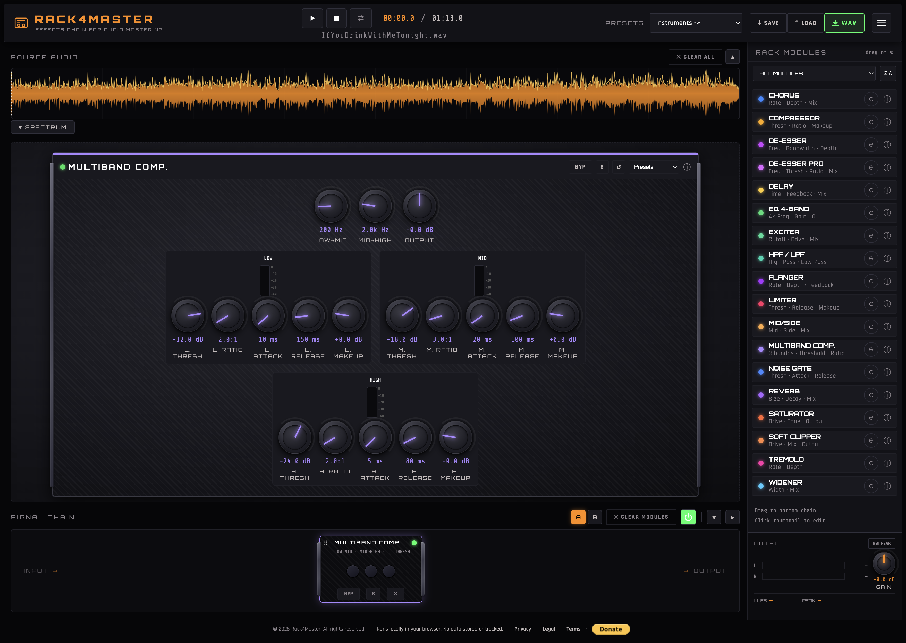

# RACK4MASTER – Free Effects Chain for Audio Mastering

**RACK4MASTER** is a professional web‑based audio mastering rack that runs entirely in your browser.  
It allows you to load any audio file, build a custom chain of processors (dynamics, filters, spatial effects, saturation, etc.), adjust parameters in real time, and export the processed audio as a WAV file.

AND MOST IMPORTANTLY... IT'S COMPLETELY FREE!

(NOTE: No data is sent to any server – everything happens locally on your machine).

## 🌟 Support the project

If you find it useful, **help us grow** by giving a star on GitHub:

You can also [donate via PayPal](https://www.paypal.com/donate?business=73KKE6DVSJ8WY&no_recurring=1&currency_code=EUR) to keep improving the tool.

## ✨ Features

- **Load any audio** (WAV, MP3, etc.) via drag & drop or file picker.
- **Interactive waveform** with click‑to‑seek, loop handles, and real‑time playback position.
- **18 built‑in audio modules**:
  - Dynamics: Gate, Compressor, Limiter, Tremolo, De‑esser (classic), De‑esser Pro, Multiband Compressor.
  - Filters: HP/LP Filter, 4‑band Equalizer.
  - Spatial: Chorus, Flanger, Reverb, Delay, Widener, Mid/Side.
  - Saturation: Saturator, Soft Clipper, Harmonic Exciter.
- **Modular signal chain** – drag & drop modules from the sidebar to the chain area, reorder them, bypass individually or globally.
- **Full parameter control** via analog‑style knobs and toggles, with real‑time audio processing.
- **Module presets** (where available) for quick setup.
- **Preset system** – save / load your entire chain + loop settings + output gain.
- **Export** the processed audio as a 16‑bit WAV file (offline rendering, respects the whole chain and bypass states).
- **VU meters** with peak hold and LUFS approximation.
- **Global bypass** to compare processed vs. raw audio instantly.
- **Dark / Light theme** and multilingual UI (English, Spanish, Catalan) – no external dependencies for translations.
- **100% client‑side** – no tracking, no data collection.

---

## 🚀 How to Use

1. **Load an audio file**  
   Drag & drop a file onto the waveform area, or click the waveform and select a file.  
   The waveform will be drawn, and the transport controls become active.

2. **Build your processing chain**  
   - Open the **right sidebar** (MÓDULOS DEL RACK).  
   - Click the `⊕` button of any module to add it to the chain.  
   - You can also drag a module from the sidebar directly into the chain area.  
   - Modules are processed from left to right (INPUT → module 1 → module 2 → ... → OUTPUT).  
   - Rearrange modules by dragging their thumbnails (drag handle `⠿`).

3. **Edit module parameters**  
   - Click on any thumbnail in the chain area to open its editor in the central panel.  
   - Adjust knobs, toggles, or select a preset. Changes are heard immediately.

4. **Bypass**  
   - Each module has a `BYP` button on its thumbnail and in its editor. Click to toggle bypass (LED turns red).  
   - The **Global Bypass** button (right‑most in the chain area) disables all modules at once for A/B comparison.

5. **Transport & Loop**  
   - Play / Pause / Stop buttons.  
   - Enable loop and drag the loop handles in the waveform to set start/end points.  
   - Click anywhere on the waveform to seek.

6. **Output gain & metering**  
   - Adjust the output gain knob (right sidebar) to increase or decrease final level.  
   - The VU meters show approximate loudness (RMS) and peak values. Click `RST PICO` to reset peak indicators.

7. **Save / Load your project**  
   - Use `↓ GUARDAR` to save a JSON preset containing module chain, all parameters, loop settings, and output gain.  
   - Use `↑ CARGAR` to load a previously saved preset.

8. **Export processed audio**  
   - Click the **WAV** button. The app will render the entire chain offline and download a 16‑bit stereo WAV file.

9. **Instrument presets**  
   - The dropdown in the header offers ready‑made chains for common sources (full mix, drums, guitar, voices, keys) or an empty project.

---

## 🛠 Built With

- **Web Audio API** – real‑time audio processing graph.
- **Sortable.js** – drag & drop reordering of modules.
- **Canvas API** – waveform drawing and overlays.
- **Google Fonts** – Orbitron, Rajdhani, Share Tech Mono.
- **No frameworks** – vanilla JavaScript modules.

---

## 📧 Contact & Support

For questions, suggestions or bug reports, please contact:

**Author:** Francesc Llorens Cerdà

**Email:** rackmaster@proton.me

---

## ⚠️ License & Legal

Rack4Master is a free, open source software under a MIT Licence. 
This software is provided "as is", without warranty of any kind.  
You must own or have permission to use the audio files you process.  
All rights reserved. © 2026

---

## 🙌 Acknowledgments

- Inspired by classic analog mastering consoles and modular racks.
- Thanks to the Web Audio API community for making real‑time audio in the browser possible.

  ---

## 💰 Donate

If you find RACK4MASTER useful, you can support the project with a donation:

