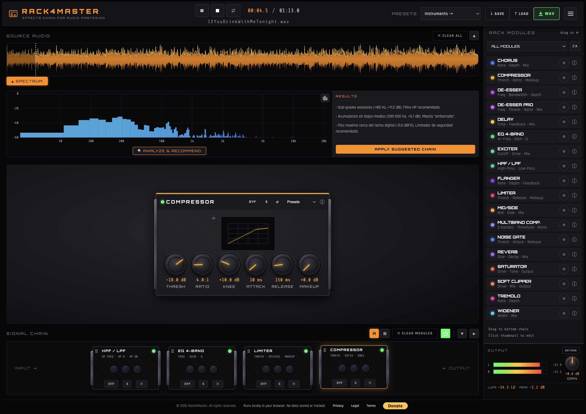

# RACK4MASTER – Free Effects Chain for Audio Mastering

**RACK4MASTER** is a professional web-based audio mastering rack that runs entirely in your browser.  
Load any audio file, build a custom chain of processors, adjust parameters in real time, and export the processed audio as a WAV file.

**AND MOST IMPORTANTLY... IT'S COMPLETELY FREE!**

> No data is sent to any server — everything happens locally on your machine.

---

## 🌟 Support the project

If you find RACK4MASTER useful, **help us grow** by giving a star on GitHub:

You can also [donate via PayPal](https://www.paypal.com/donate?business=73KKE6DVSJ8WY&no_recurring=1&currency_code=EUR) to keep improving the tool.

---

## ✨ Features

- **Load any audio** (WAV, MP3, etc.) via drag & drop or file picker.
- **Interactive waveform** with click-to-seek, loop handles, and real-time playback position.
- **15 professional audio modules** (higher DSP quality):

### 🎛 Dynamics
| Module | Description |
|---|---|
| **Gate** | Real downward expander with envelope follower and Hold time. Eliminates noise in silences. |
| **Compressor** | Dynamic range control with adjustable knee, attack, release and makeup gain. |
| **Limiter** | Brickwall limiter with 1 ms attack, aligned with streaming targets (−1 dBTP). |
| **De-esser** | Dynamic sibilance control: only cuts when the level exceeds the threshold — not a static notch. |
| **Multiband** | 3-band compressor with LR4 Linkwitz-Riley crossover for perfectly flat band summation. |
| **Tremolo** | Amplitude modulation for rhythmic effects. |

### 🎚 Filters
| Module | Description |
|---|---|
| **Filter HP/LP** | Independent High-Pass and Low-Pass filters with ON/OFF toggles. |
| **EQ 4-Band** | Low shelf + 2× Peaking + High shelf. Interactive frequency curve with draggable nodes. |

### 🌐 Spatial
| Module | Description |
|---|---|
| **Reverb** | Improved IR with frequency-dependent HF decay (air absorption). New Damping control. |
| **Delay** | Echo with LP filter in the feedback path for tape-style degradation. |
| **Modulation** | Chorus + Flanger + Vibrato in one module with mode selector. |
| **Exciter** | Adds brightness and air via even-order harmonics. Oversample 4×. |
| **Widener** | Haas stereo widening. Proper stereo channel routing + Mono Bass for mono compatibility. |
| **Mid/Side** | Process center and sides independently. Normalized M/S matrix (unity = 0 dB). |

### 🔥 Saturation
| Module | Description |
|---|---|
| **Harmonic Drive** | Soft (tanh normalized) · Tape (asymmetric, even harmonics) · Hard (polynomial clip). Oversample 4× on all modes. |

---

- **A/B comparison slots** — maintain two independent mastering chains and switch instantly.
- **Solo mode** — isolate a single module, available on thumbnails and cards.
- **Spectrum analyzer** — real-time frequency visualization (bar/line modes, labeled Hz/dB axes).
- **Intelligent analysis assistant** — detects frequency imbalances, dynamics issues and stereo problems; recommends a custom chain.
- **Modular signal chain** — drag & drop from sidebar, reorder thumbnails, bypass individually or globally.
- **Full parameter control** via analog-style knobs and toggles with real-time audio processing.
- **Module presets** — 7+ presets per module for quick setup.
- **35+ instrument & genre presets** with explicit parameters for all modules:
  - Guitars (6): Acoustic, Classical, Clean, Drive, Metal, Fuzz
  - Pianos/Keys (4): Grand Piano, Studio Piano, Rhodes, Synth
  - Vocals (5): Lead, Male, Female, Choir, Rap
  - Drums/Percussion (6): Acoustic, Studio, Vintage, Jazz, Electronic, Percussion
  - Orchestral (3): Strings, Brass, Woodwinds
  - Mix by Genre (10): Rock, Blues, Country, Folk, Jazz, Urban, Latino, Pop, Ballad, Mastering
- **Preset system** — save/load entire chain (both A/B slots) + loop settings + output gain as JSON. Backward-compatible with presets from older versions.
- **WAV Export** — choose 16 bit (with TPDF dithering) or 24 bit, at original or 48 kHz sample rate.
- **Professional TPDF dithering** — applied on 16-bit export to eliminate quantization distortion.
- **VU meters** with peak hold and LUFS approximation.
- **Global bypass** — compare processed vs. raw audio instantly.
- **Dark / Light theme** and multilingual UI (English, Spanish, Catalan).
- **100% client-side** — no tracking, no data collection, no server uploads.

---

## 🚀 How to Use

### 1. Load an audio file
Drag & drop a file onto the waveform area, or click it to select a file.

### 2. Build your processing chain
- Open the **right sidebar** (RACK MODULES).
- Click `⊕` or double-click any module to add it to the chain.
- Drag a module from the sidebar directly into the chain area at any position.
- Modules are processed **left to right**: INPUT → module 1 → module 2 → ... → OUTPUT.
- Reorder modules by dragging their thumbnails via the `⠿` handle.

### 3. Edit module parameters
- Click any thumbnail to open its editor in the central panel.
- Adjust knobs (drag up/down or use mouse wheel), toggles, or choose a preset.
- **Double-click** any knob to reset it to its default value.
- Changes are heard in real time.

### 4. Solo mode
Press **S** on any module thumbnail or card to solo it — all other modules are temporarily bypassed. Press **S** again to restore the full chain.

### 5. A/B comparison
Use **A** and **B** buttons in the chain toolbar to maintain two independent setups. Switching is instant; both slots are saved together in a preset file.

### 6. Spectrum analyzer & AI recommendations
- Click **▼ SPECTRUM** to open the frequency analyzer.
- Press **🔍 ANALYZE & RECOMMEND** to scan the full audio and detect problems.
- Click **APPLY SUGGESTED CHAIN** to load the recommended modules automatically.
- Use **⎘ COPY RESULTS** to copy the analysis text to clipboard.

### 7. Bypass
- Each module has a `BYP` button — LED turns red when bypassed.
- **Global Bypass** (chain toolbar) disables all modules at once.

### 8. Transport & Loop
- Play / Pause / Stop controls.
- Enable loop with the Loop button, then drag the loop handles on the waveform.
- Click anywhere on the waveform to seek. Keyboard shortcuts available (see below).

### 9. Output gain & metering
- Adjust the output gain knob (right sidebar) — double-click to reset to 0 dB.
- VU meters show RMS and peak values. `RST PEAK` resets peak indicators.

### 10. Save / Load project
- `↓ SAVE` — exports a JSON file with the full chain, both A/B slots, loop settings, and output gain.
- `↑ LOAD` — loads a previously saved preset. Old presets (with renamed modules) are migrated automatically.

### 11. Export WAV
Click **WAV** → choose bit depth (16 or 24) and sample rate → the entire chain renders offline and downloads automatically.

### 12. Instrument & genre presets
The dropdown in the header offers 35+ ready-made chains. All presets include explicit parameter values for every module — not just default settings.

---

## ⌨️ Keyboard Shortcuts

| Key | Action |
|---|---|
| `Space` | Play / Pause |
| `S` | Stop and rewind |
| `L` | Toggle loop |
| `←` / `→` | Seek ±5 seconds |
| `Home` | Go to start |
| `End` | Go to end |
| `B` | Toggle global bypass |
| `R` | Reset peak meters |
| `Delete` / `Backspace` | Remove selected module |
| Double-click knob | Reset to default value |

---

## 🔧 DSP Quality Notes

- **Gate**: proper downward expander (ScriptProcessorNode), not a compressor. Correctly attenuates signals *below* threshold.
- **Limiter**: 1 ms attack (was 30 ms in previous versions) to catch fast transients.
- **Mid/Side**: normalized M/S matrix — unity processing produces exactly 0 dB gain change.
- **Widener**: correct stereo channel routing — both L and R channels preserved; Mono Bass parameter for low-end phase coherence.
- **Harmonic Drive / Exciter**: `oversample: '4x'` on all WaveShaperNodes to minimize aliasing.
- **Reverb**: frequency-dependent IR decay (HF absorbs faster than LF, like real rooms).
- **Multiband**: LR4 Linkwitz-Riley crossover (two cascaded 2nd-order Butterworth at Q=0.707) for flat magnitude summation.

---

## 🛠 Built With

- **Web Audio API** — real-time audio processing graph.
- **Sortable.js** — drag & drop reordering.
- **Canvas API** — waveform and spectrum visualization.
- **Google Fonts** — Orbitron, Rajdhani, Share Tech Mono.
- **No frameworks** — vanilla JavaScript ES modules.

---

## 📧 Contact & Support

**Author:** Francesc Llorens Cerdà  
**Email:** rackmaster@proton.me

For questions, suggestions or bug reports, please open an issue on GitHub.

---

## ⚠️ License & Legal

RACK4MASTER is free, open source software under the **MIT License**.  
Provided "as is", without warranty of any kind.  
You must own or have permission to use the audio files you process.  
© 2026 Francesc Llorens Cerdà. All rights reserved.

---

## 🙌 Acknowledgments

- Inspired by classic analog mastering consoles and modular racks.
- Thanks to the Web Audio API community for making real-time audio in the browser possible.

---

## 💰 Donate

If you find RACK4MASTER useful, please consider supporting the project:

